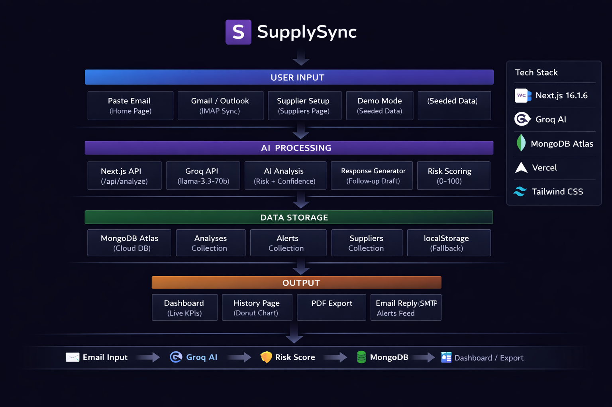

# SupplySync — AI-Powered Email Intelligence for Suppliers

> Turn Supplier Emails Into Cashflow Decisions in Seconds

## 🏗 Architecture



## 🎯 Problem
Small suppliers receive dozens of emails daily from large companies — 
invoices, purchase orders, compliance requests, payment disputes. 
Manually tracking these leads to missed payments, delayed responses, 
and lost revenue worth thousands of dollars.

## ✨ Features
- 🤖 AI Email Analysis — Instant analysis using Groq API (Llama 3.3 70B)
- 💰 Payment Delay Detection — Automatically identifies delayed payments
- ⚠️ Risk Assessment — Scores emails as Low, Medium, or High risk (0-100)
- 📝 Auto-Generated Responses — Professional follow-up emails instantly
- 📊 Live Dashboard — Real-time KPIs, Money at Risk, Supplier Risk Score
- 🔔 Alerts Feed — Real-time high risk and overdue invoice notifications
- 📚 Email History — Donut chart, filters, full analysis timeline
- 📄 PDF Generator — Professional payment reminder documents
- 📬 Gmail/Outlook Integration — IMAP sync and SMTP reply
- 🎨 Beautiful Dark UI — Modern, responsive design

## 🚀 Live Demo
[supplysync-five.vercel.app](https://supplysync-five.vercel.app)

## 🛠️ Tech Stack
- **Frontend:** Next.js 16.1.6, TypeScript, Tailwind CSS, shadcn/ui
- **UI Library:** Framer Motion, Lucide Icons, Anime.js
- **AI:** Groq API (Llama 3.3 70B)
- **Database:** MongoDB Atlas
- **PDF Generation:** React PDF
- **Deployment:** Vercel (CI/CD via GitHub)

## 🏗️ Installation

1. Clone the repository:
```bash
git clone https://github.com/Krithik0908/supplysync.git
cd supplysync
```

2. Install dependencies:
```bash
npm install
```

3. Create a `.env.local` file in the root directory:
```env
GROQ_API_KEY=your_groq_api_key_here
MONGODB_URI=your_mongodb_connection_string_here
```

4. Run the development server:
```bash
npm run dev
```

5. Open [http://localhost:3000](http://localhost:3000) in your browser.

## 🗄️ MongoDB Setup
1. Create a free [MongoDB Atlas](https://www.mongodb.com/atlas) account
2. Create a new cluster (M0 Free tier)
3. Add `0.0.0.0/0` to IP Access List
4. Get your connection string
5. Add it to `.env.local` as `MONGODB_URI`

## 🤖 Groq API Setup
1. Sign up at [Groq Console](https://console.groq.com)
2. Get your API key
3. Add it to `.env.local` as `GROQ_API_KEY`

## 📁 Project Structure
```
supplysync/
├── app/
│   ├── api/
│   │   ├── analyze/      # Groq AI integration
│   │   ├── history/      # MongoDB data fetching
│   │   ├── demo/         # Demo mode seeded data
│   │   ├── suppliers/    # Supplier settings
│   │   └── generate-pdf/ # PDF generation
│   ├── dashboard/        # Live KPI dashboard
│   ├── history/          # Email history + charts
│   ├── suppliers/        # Settings + email integration
│   ├── analysis/         # Analysis results page
│   ├── response/         # Generated reply page
│   └── page.tsx          # Home page
├── components/
│   ├── ui/               # shadcn/ui components
│   └── navbar.tsx        # Navigation
├── lib/
│   └── mongodb.ts        # MongoDB connection
└── public/               # Static assets
```

## 🎯 Key Features Explained

### Email Analysis
- Paste any supplier email on the home page
- AI extracts purpose, payment status, risk level and confidence score
- Get suggested action instantly with reasoning

### Live Dashboard
- Real-time KPIs — Total Emails, High Risk Count, Payment Delays
- Money at Risk in dollars, Avg Payment Delay in days
- Supplier Risk Score out of 100
- Auto-refreshes every 30 seconds with LIVE indicator
- Toast alerts for new high-risk emails

### Email History
- View all past analyses in card grid layout
- Donut chart showing risk distribution (Low/Medium/High)
- Filter by All, High Risk, Payment Delayed, Low Risk
- One-click access to full AI reply

### Gmail/Outlook Integration
- Connect your mailbox via IMAP using app password
- Sync inbox automatically — emails analyzed by AI instantly
- Send replies directly via SMTP without leaving the app

### PDF Generation
- Create professional payment reminder documents
- Includes analysis summary and drafted reply
- Download and print ready

### Alerts Feed
- Real-time notifications for overdue invoices
- HIGH and MEDIUM severity badges
- Never miss a critical payment deadline

## 🚀 Deployment
1. Push code to GitHub
2. Connect repository to [Vercel](https://vercel.com)
3. Add environment variables (GROQ_API_KEY, MONGODB_URI)
4. Deploy automatically on every push

## 📝 License
MIT License — feel free to use this project for your own purposes.

## 📧 Contact
**Krithik S** — krithiksaravanan0902@gmail.com

- GitHub: [Krithik0908](https://github.com/Krithik0908)
- Project: [github.com/Krithik0908/supplysync](https://github.com/Krithik0908/supplysync)
- Live: [supplysync-five.vercel.app](https://supplysync-five.vercel.app)
